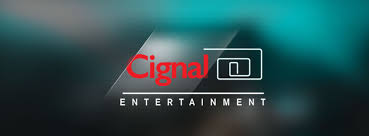

# Cignal Payroll System
Demonstration web app showing the capabilities of ASP.NET Core 2 MVC, EF (Entity Framework), Web API, Bootstrap, jQuery, datatables, adminlte template and many more.

# Technology
- ASP.NET Core 2 MVC
- EF (Entity Framework) Core Code First
- jQuery
- Ajax
- ASP.NET Core 2 Web API
- Adminlte template
- datatables.net
- Dependency Injection
- Email Handling (SendGrid and SMTP)
- Custom 404/500 error handling
- file upload (using blueimp jquery file upload)
	
# Screenshots

	
	
